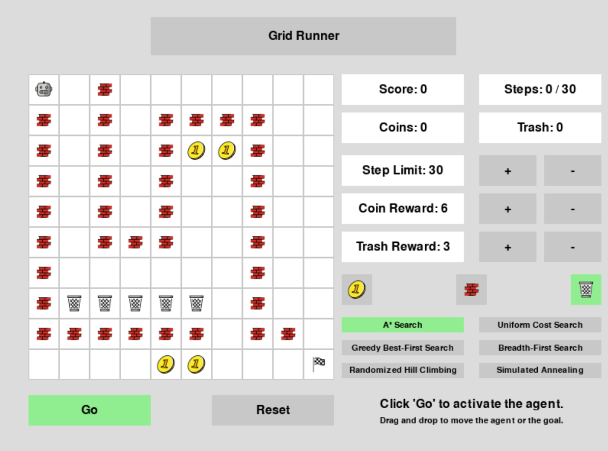

# Grid Runner

### About



Grid Runner is an AI game where an agent navigates a 10x10 grid in search of a goal. The user sets a step limit, and the 
agent must plan the most efficient path to the goal within that constraint. Users can dynamically adjust the environment 
during execution by dragging the agent or goal to new positions, prompting the agent to re-plan its path in real time.
The goal of Grid Runner is to enhance classical pathfinding algorithms with reward awareness, enabling agents to prioritize 
multiple objectives beyond shortest-path planning.

Users can also place (`left click`) and remove (`right click`) the following objects on the grid:

##### Walls

  - Impassable cells that restrict the agent’s movement. These can be used to create obstacles and mazes.  

##### Coins
  - Collectible objects that provide a reward for the agent. Agents using informed pathfinding algorithms, including A* Search, Greedy Best-First Search, Randomized Hill Climbing, and Simulated Annealing, will attempt to collect as many coins as they can while still reaching the goal within the step limit.
 
##### Trash
  - A competing reward that the agent must balance with coins. The user can assign reward values for both trash and coins, and the agent will attempt to maximize its cumulative reward within the step limit.

Users can choose from a variety of pathfinding strategies. Grid Runner currently supports:

#### Reward-unaware Uninformed Algorithms

  - Breadth-First Search (BFS)
  - Uniform Cost Search (UCS)

#### Reward-aware Informed Algorithms 

- A* Search 
- Greedy Best-First Search

##### Reward-aware Local Search

- Randomized Hill Climbing
- Simulated Annealing


## Requirements

The following tools and libraries are required to run Grid Runner on your machine:

| Tool/Framework                                      | Purpose                                                                                  |
|-----------------------------------------------------|------------------------------------------------------------------------------------------|
| Python 3.13                                          | Programming language used for this project                                               |
| Pygame                                               | Python game engine used to render the GUI and handle user input                          |
| Matplotlib                                           | Used for visualization of performance data                                               |
| NumPy                                                | Used for efficient representation and manipulation of the game grid                      |
| random, os, json, time, itertools, heapq, collections, abc, enum | Standard Python libraries used for randomness, file I/O, time measurement, and internal pathfinder logic |


## How to Run Grid Runner

1. Once the project directory is extracted from the zip file, open a terminal and navigate to the root directory (`grid_runner/`).
2. Create a virtual environment with Python 3.13:

For macOS/Linux machines:
```bash
python3 -m venv .venv
source .venv/bin/activate
```

For Windows machines:
```bash
.venv\Scripts\activate
```

3. Install dependencies:
```bash
pip install -r requirements.txt
```

4. Run the game:
```bash
python main.py
```

**Note:** On some systems, you may need to use `python3` instead of `python` in the above terminal commands.


For full project details, please read the [Grid Runner PDF](grid_runner_multi_objective_ai_pathfinding_in_2d_environments.pdf).

_Created by Jack Einbinder, 2025_
